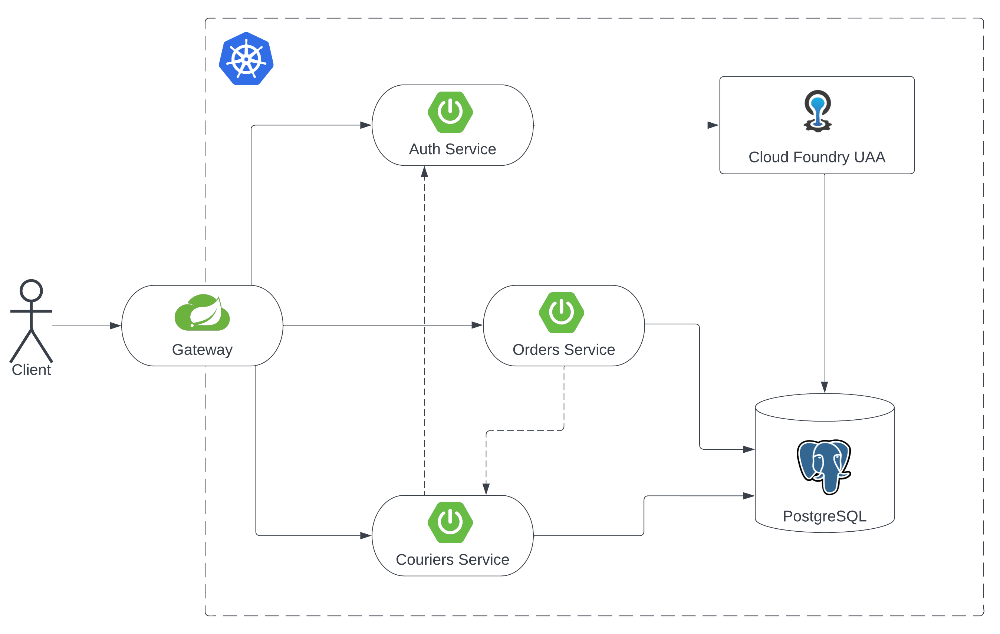

# Parcel Delivery App

A microservices based application demonstrating the backend of a simple parcel delivery application.



## Technologies & Tools Used

The tech stack of the project includes:
* Java 11
* Spring Boot
* Spring Cloud
* Gradle
* Liquibase
* Docker & Kubernetes
* Spock Framework

## Deploying & Running the Application

The application can be deployed and run on a local Kubernetes cluster.

### Deploying & Running on Local Kubernetes

To build, deploy and run the application on a local Kubernetes cluster,
run the following commands in the root directory of the project:

```console
$ ./build.sh
$ kubectl create namespace parcel-delivery-app
$ kubectl apply -Rf k8s/ -n parcel-delivery-app
```

Gateway application will be running on the node port 30000
after running these commands. Also, an [Adminer](https://www.adminer.org/)
instance will be running on the node port 30010 and can be used for
database management.

### Logging in to Adminer

To log in to Adminer, first navigate to <http://localhost:30010> in your browser.
Then you can log in to Adminer using following credentials:

**System:** PostgreSQL
<br>
**Server:** postgres
<br>
**Username:** parcel_app
<br>
**Password:** secret
<br>
**Database:** parcel_app

After logging in to Adminer, the database objects related to the application
can be found under the database **parcel_app**; schemas **uaa**, **order**, **courier**.

### Using the Application

After deploying the application, **Swagger** documentation of the microservices will be available in the
centralized Swagger UI on <http://localhost:30000/swagger-ui.html>.
You can navigate through different microservices' Swagger documentations using
**_"Select a definition"_** drop-down list in the top-right corner of the page.

#### User Creation and Login

New users can be created using **`POST /api/auth/users`** endpoint of the Auth Service.

Once you've created the user, you can log in and get an access token using
**`POST /api/auth/token`** endpoint.

#### Creating Users With Different Roles

Some endpoints may require some privileges. There are two roles besides
plain user role: **courier**, **admin**.

To create an admin account, first create a regular account using **`POST /api/auth/users`**
endpoint like mentioned before. Then add this user to **admin** group using
**`POST /api/auth/users/{userId}/groups`** endpoint. The second operation can
be performed by admin users only. There's a predefined admin user with username **admin**
and password **admin**.

To create an account with **courier** role, **`POST /api/couriers`** endpoint
can be used by a user having **admin** role.

#### Using the APIs

After logging in with a user, the APIs can be used with bearer authentication
using the access token obtained from the token service. For detailed information
about the APIs, check Swagger documentations.
